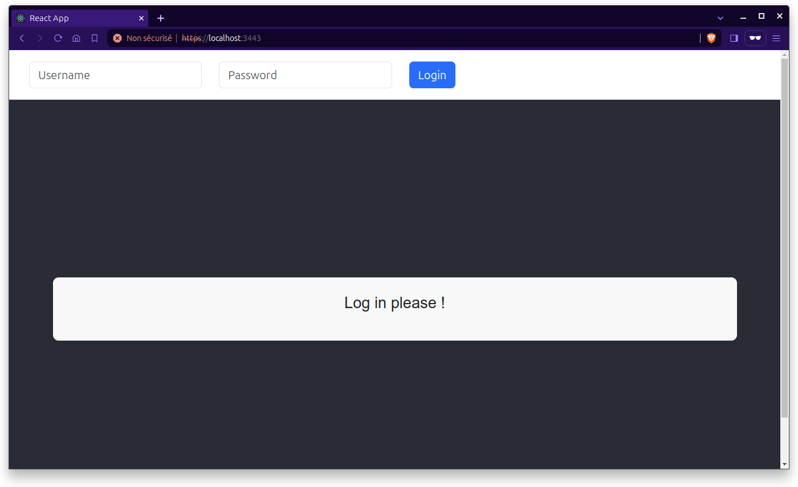

# POC pour le système d'intervention d'urgence en temps réel

Le but de ce projet est de créer un POC (preuve de concept) afin de faire adhérer les parties prenantes au projet de développement d'un système d'intervention d'urgence en temps réel par l'équipe d'architecture métier du consortium MedHead.

Le projet consiste à développer une application en suivant le modèle d'architecture en microservices.

## Applications

L'application est composée de 5 services qui communiqueront entre eux :

- ### 4 services backend (Spring Boot REST API) :

  - #### speciality-service

    Application Java Web `Spring Boot` qui expose une API REST pour gérer les spécialités.

  - #### hospital-service

    Application Java Web `Spring Boot` qui expose une API REST pour gérer les hôpitaux

  - #### destination-service

    Application Java Web `Spring Boot` qui expose une API REST pour trouver l'hôpital le plus proche en fonction d'une localisation et une spécialité.

  - #### notification-service

    Application Java Web `Spring Boot` qui expose une API REST pour envoyer une notification de réservation à l'hôpital choisit.

- ### 1 service frontend (React)

  - #### medhead-ui

    Application front `React` où les utilisateurs peuvent gérer les films. Toute communication avec `destination-service` se fait en `HTTPS`

## Prérequis

- [`Docker`](https://docs.docker.com/get-docker/)
- [`Docker Compose`](https://docs.docker.com/compose/install/)
- [`Java 17+`](https://www.oracle.com/java/technologies/downloads/#java17)
- [`Maven`](https://maven.apache.org/install.html)
- [`npm`](https://docs.npmjs.com/downloading-and-installing-node-js-and-npm)
- [`Jenkins`](https://www.jenkins.io/doc/book/installing/)

## Lancement des applications

1. Cloner le projet en local

   ```
    git clone https://github.com/samirguemri/OC__P11_CODE.git
    cd OC__P11_CODE
   ```

2. Installer les dépendances et Créer les packages

- **docker compose**

  - Ouvrir un `terminal` et, depuis le dossier root qui contien le fichier docker-compose.yaml, executer la commande

    ```
    docker compose up -d --build
    ```

- **notification-service**

  Depuis un terminal, executer la commande suivante

  ```
  docker exec -it kafka bash
  ```

  ensuite, executer la commande suivante depuis le `bash`

  ```
  kafka-console-consumer --topic hospitalReservation --bootstrap-server kafka:9092
  ```

- **medhead-ui**

  - Ouvrir un `terminal` et, depuis le dossier `front/medhead-ui/`, executer la commande

    ```
    npm install
    ```

  - Pour lancer l'application `medhead-ui`

    ```
    npm start
    ```

  - Accéder à l'adresse [`https://localhost:3443`]

  - Pour une première connexion, cette page apparet

  

  - Cliquer sur `Paramètres avancés` > `Continuer vers le site localhost (dangereux)`

  vous devez voir ceci

  

- **Jenkins**

  - You can start the Jenkins service with the command:

    ```
    sudo systemctl start jenkins
    ```

    The command: sudo cat /var/lib/jenkins/secrets/initialAdminPassword will print the password at console.

## Arrêt des applications

- Pour arrêter les services backend `speciality-service`, `hospital-service`, `destination-service` et `notification-service`, aller dans le terminal où ils sont exécutés et appuyer sur `Ctrl+C`

- Pour arrêter les `containers`

  ```
  docker compose down
  ```

## Creation d'une `self-signed certificate`

- Pour créer une certification `PKCS12`, executer la commande suivante

  ```
  keytool -genkeypair -alias medhead -keyalg RSA -keysize 2048 -storetype PKCS12 -keystore localSSL.jks -validity 365 -dname "CN=localhost, OU=medhead, O=medhead, L=Nice, ST=AM, C=FR"
  ```

- Entrer un mot de passe. Pour ce projet, nous utilisons `medhead`

  ```
  Enter keystore password: medhead
  Re-enter new password: medhead
  ```
