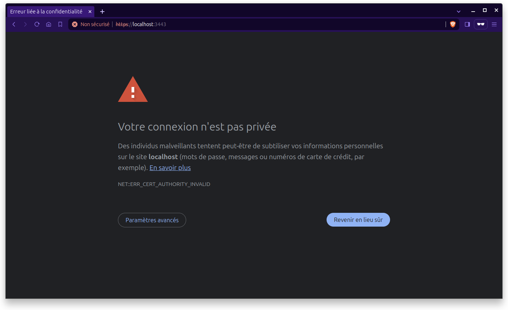
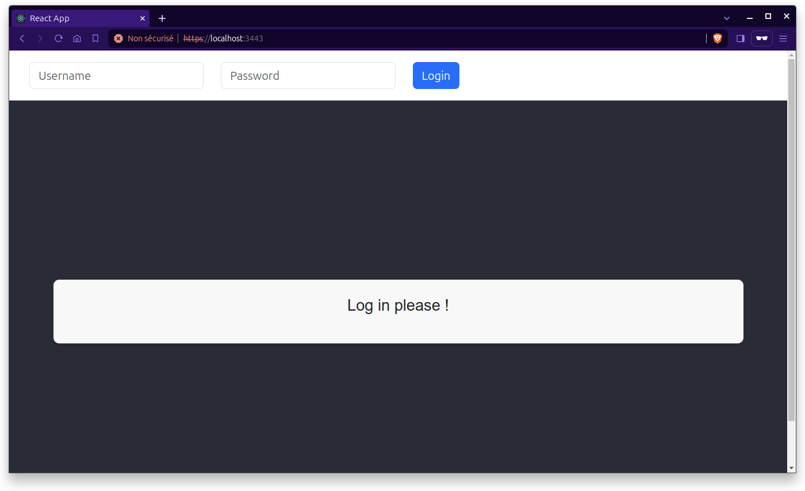

# POC pour le système d'intervention d'urgence en temps réel

Le but de ce projet est de créer un POC (preuve de concept) afin de faire adhérer les parties prenantes au projet de développement d'un système d'intervention d'urgence en temps réel par l'équipe d'architecture métier du consortium MedHead.

Le projet consiste à développer une application en suivant le modèle d'architecture en microservices.

## L'application et ses 5 services

L'application est composée de 5 services qui communiqueront entre eux :

### 4 services backend (Spring Boot REST API) :

- #### speciality-service

  Application Java Web `Spring Boot` qui expose une API REST pour gérer les spécialités.

- #### hospital-service

  Application Java Web `Spring Boot` qui expose une API REST pour gérer les hôpitaux

- #### destination-service

  Application Java Web `Spring Boot` qui expose une API REST pour trouver l'hôpital le plus proche en fonction d'une localisation et une spécialité.

- #### notification-service

  Application Java Web `Spring Boot` qui expose une API REST pour envoyer une notification de réservation à l'hôpital choisit.

### 1 service frontend (React)

- #### medhead-ui

  Application front `React` où les utilisateurs peuvent calculer l'Hôptial le plus proche en fonction de leur position et d'une sélection de spécialité. Toute communication avec `destination-service` se fait en `HTTPS`

## Lancement des applications en localhost

### Méthode 1 : Utiliser des containers

#### Prérequis

- [`Docker`](https://docs.docker.com/get-docker/)
- [`Docker Compose`](https://docs.docker.com/compose/install/)

1. Cloner le projet en local

   ```
    git clone https://github.com/samirguemri/OC__P11_CODE.git
    cd OC__P11_CODE
   ```

2. Créer et éxecuter des containers

- **docker compose**

  - Ouvrir un `terminal` et, depuis le dossier root qui contient le fichier docker-compose.yaml, executer la commande

  ```
  docker compose up -d --build
  ```

- **notification-service**

  Depuis un terminal, executer la commande suivante

  ```
  docker exec -it kafka bash
  ```

  ensuite, executer la commande suivante depuis le `bash`

  ```
  kafka-console-consumer --topic hospitalReservation --bootstrap-server kafka:9092
  ```

### Méthode 2 : Builder et éxecuter en local

#### Prérequis

- [`Java 17+`](https://www.oracle.com/java/technologies/downloads/#java17)
- [`Docker`](https://docs.docker.com/get-docker/)
- [`Maven`](https://maven.apache.org/install.html)
- [`npm`](https://docs.npmjs.com/downloading-and-installing-node-js-and-npm)

#### Etapes

1. Cloner le projet en local

    ```
    git clone https://github.com/samirguemri/OC__P11_CODE.git
    cd OC__P11_CODE
    ```

2. Démarrer MongoDB dans un docker container

    Télécharger l'image mongo et démarrer le docker container

    ```
    docker pull mongo
    docker run -d -p 27017:27017 --name mongodb mongo
    ```

    Importer les spécialités et les hôpitaux dans mongodb

    ```
    docker cp resources/medhead.hospital.json mongodb:/hospitals.json
    docker exec -it mongodb mongoimport --db mongodb --collection hospital --file hospitals.json --jsonArray
    ```

    ```
    docker cp resource/medhead.speciality.json mongodb:/specialities.json
    docker exec -it mongodb mongoimport --db mongodb --collection speciality --file specialities.json --jsonArray
    ```

3. Builder les applications

    **speciality-service**

    1. Ouvrir un nouveau terminal dans le dossier root du projet

    2. Builder speciality-service

      ```
      cd back/speciality-service
      mvn clean install
      ```

    3. Executer `speciality-service`

      ```
      java -jar target/speciality-service.jar
      ```

    **hospital-service**

    1. Ouvrir un nouveau terminal dans le dossier root du projet

    2. Builder hospital-service

      ```
      cd back/hospital-service
      mvn clean install
      ```

    3. Executer `hospital-service`

      ```
      java -jar target/hospital-service.jar
      ```

    **destination-service**

    1. Ouvrir un nouveau terminal dans le dossier root du projet

    2. Builder destination-service

      ```
      cd back/destination-service
      mvn clean install
      ```

    3. Executer `destination-service`

      ```
      java -jar target/destination-service.jar
      ```

    **notification-service**

    1. Ouvrir un nouveau terminal dans le dossier root du projet

    2. Builder notification-service

      ```
      cd back/notification-service
      mvn clean install
      ```

    3. Executer `notification-service`

      ```
      java -jar target/notification-service.jar
      ```

    Depuis un terminal, executer la commande suivante

      ```
      docker exec -it kafka bash
      ```

    - ensuite, executer la commande suivante depuis le `bash`

      ```
      kafka-console-consumer --topic hospitalReservation --bootstrap-server kafka:9092
      ```

    **medhead-ui**

    1. Ouvrir un nouveau terminal dans le dossier root du projet

    2. Builder medhead-ui

      ```
      cd front/medhead-ui
      npm install
      ```

    3. Lancer `medhead-ui` dans un navigateur

      ```
      npm start
      ```

    - Accéder à l'adresse [`https://localhost:3443`]

    - Pour une première connexion, cette page apparet

    

    - Cliquer sur `Paramètres avancés` > `Continuer vers le site localhost (dangereux)`

    vous devez voir ceci

    

    - Utiliser `user` et `pass` pour vous connecter

## Déploiement des applications

### Prérequis

- [`Jenkins`](https://www.jenkins.io/doc/book/installing/)
- [`Minikube`](https://minikube.sigs.k8s.io/docs/start/)
- [`ArgoCD`](https://argo-cd.readthedocs.io/en/stable/getting_started/)

1. CI Pipeline

- **Jenkins**

  - You can start the Jenkins service with the command:

  ```
  sudo systemctl start jenkins
  ```

  The command: sudo cat /var/lib/jenkins/secrets/initialAdminPassword will print the password at console.

2. CD Pipeline

- **Kubernetes**

  - installing kubernetes

  - start k8s cluster locally

  '''
  minikube start --driver=docker
  minikube status
  '''

  - get minikube node's ip address

  '''
  minikube ip
  '''

- get node information (nop <> pod)

  '''
  kubectl get nod -o wide
  '''

  - create k8s components before configuring argoCD application:

  - create the `medhead` namespace

  '''
  kubectl apply -f medhead-namespace.yaml
  '''

  - deploying mongodb application (and mongo-express for demo purposes)

  '''
  kubectl apply -n medhead -f setup/mongo/secret.yaml
  kubectl apply -n medhead -f setup/mongo/service.yaml
  kubectl apply -n medhead -f setup/mongo/configmap.yaml
  kubectl apply -n medhead -f setup/mongo/statefulset.yaml
  kubectl apply -n medhead -f setup/mongo/volume.yaml
  '''

  - deploying zookeeper application

  '''
  kubectl apply -n medhead -f setup/kafka/configmap.yaml
  kubectl apply -n medhead -f setup/kafka/secret.yaml
  kubectl apply -n medhead -f setup/kafka/service.yaml
  kubectl apply -n medhead -f setup/kafka/statefulset.yaml
  kubectl apply -n medhead -f setup/kafka/volume.yaml
  '''

  - deploying kafka application

  '''
  kubectl apply -n medhead -f setup/kafka/configmap.yaml
  kubectl apply -n medhead -f setup/kafka/secret.yaml
  kubectl apply -n medhead -f setup/kafka/service.yaml
  kubectl apply -n medhead -f setup/kafka/statefulset.yaml
  kubectl apply -n medhead -f setup/kafka/volume.yaml
  '''

  - configuring argoCD's service applications to automatically deploy and sync service applications :

  '''
  kubectl apply -n medhead -f applications/speciality-application.yaml
  kubectl apply -n medhead -f applications/hospital-application.yaml
  kubectl apply -n medhead -f applications/destination-application.yaml
  kubectl apply -n medhead -f applications/notification-application.yaml
  kubectl apply -n medhead -f applications/medhead-ui-application.yaml
  '''

- **ArgoCD**

- intall argoCD

  -Fetch Password

  '''
  kubectl -n argocd get secret argocd-initial-admin-secret -o jsonpath="{.data.password}" | base64 -d

  '''

- test

  '''
  kubectl port-forward svc/argocd-server -n argocd 7080:443
  kubectl patch svc argocd-server -n argocd -p '{"spec": {"type": "NodePort"}}'
  '''

## Arrêt des applications

- Pour arrêter les services backend `speciality-service`, `hospital-service`, `destination-service` et `notification-service`, aller dans le terminal où ils sont exécutés et appuyer sur `Ctrl+C`

- Pour arrêter les `containers`

  ```
  docker compose down
  ```

## Creation d'une `self-signed certificate`

- Pour créer une certification `PKCS12`, executer la commande suivante

  ```
  keytool -genkeypair -alias medhead -keyalg RSA -keysize 2048 -storetype PKCS12 -keystore localSSL.jks -validity 365 -dname "CN=localhost, OU=medhead, O=medhead, L=Nice, ST=AM, C=FR"
  ```

- Entrer un mot de passe. Pour ce projet, nous utilisons `medhead`

  ```
  Enter keystore password: medhead
  Re-enter new password: medhead
  ```
