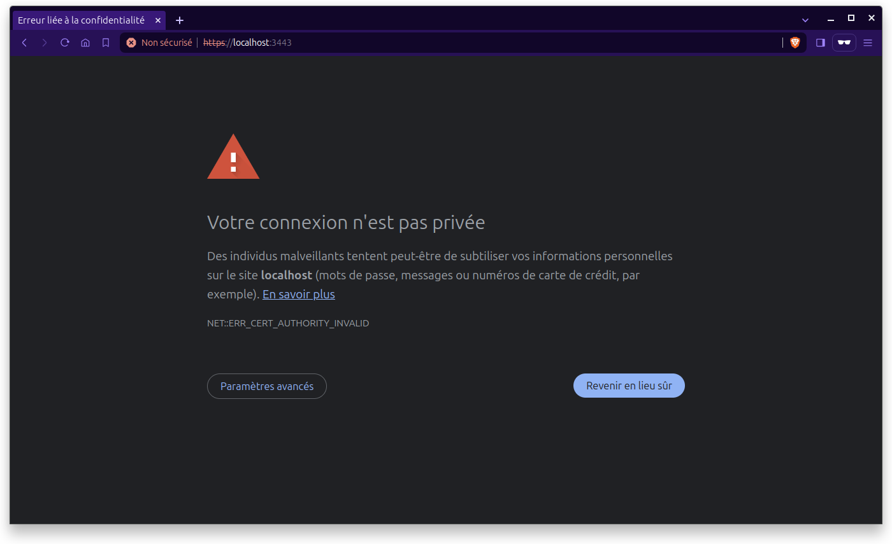
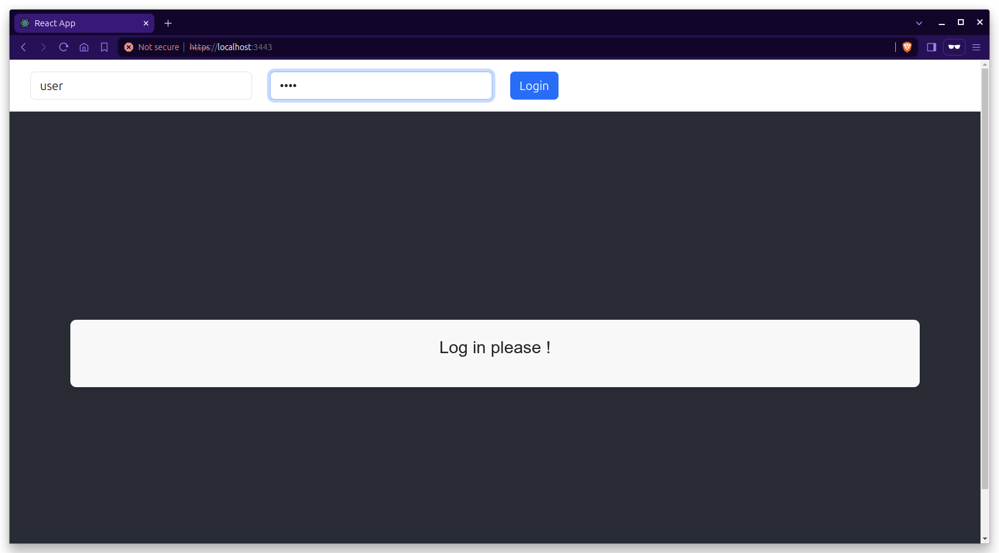
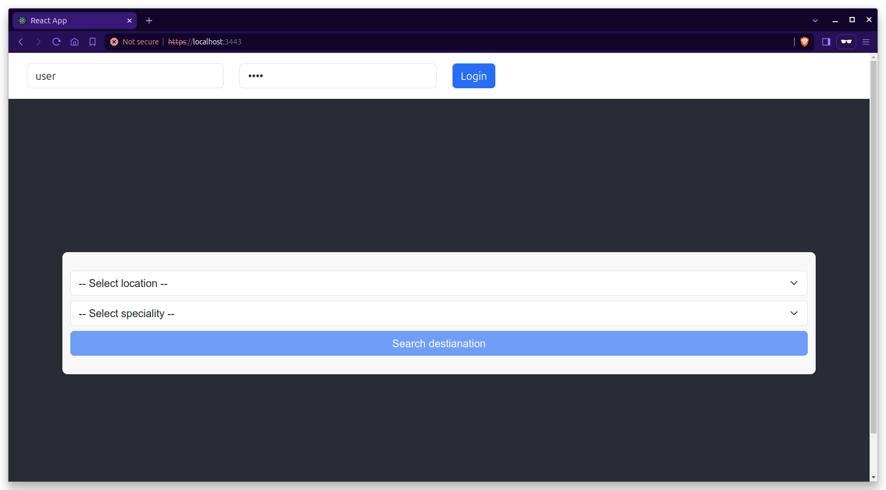
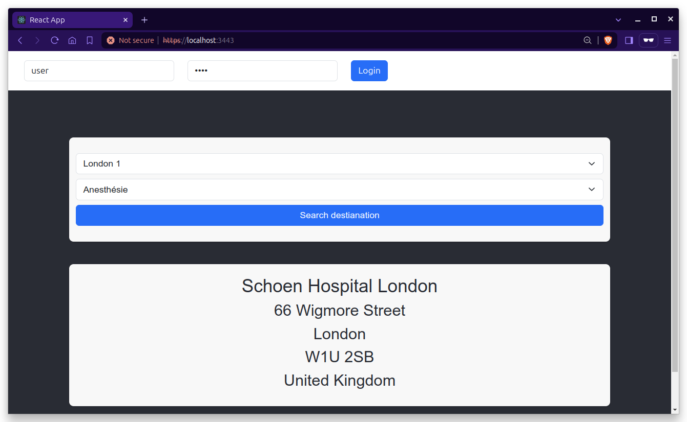
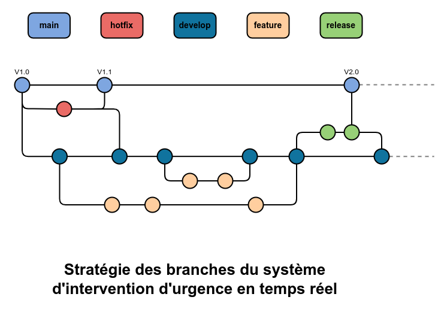
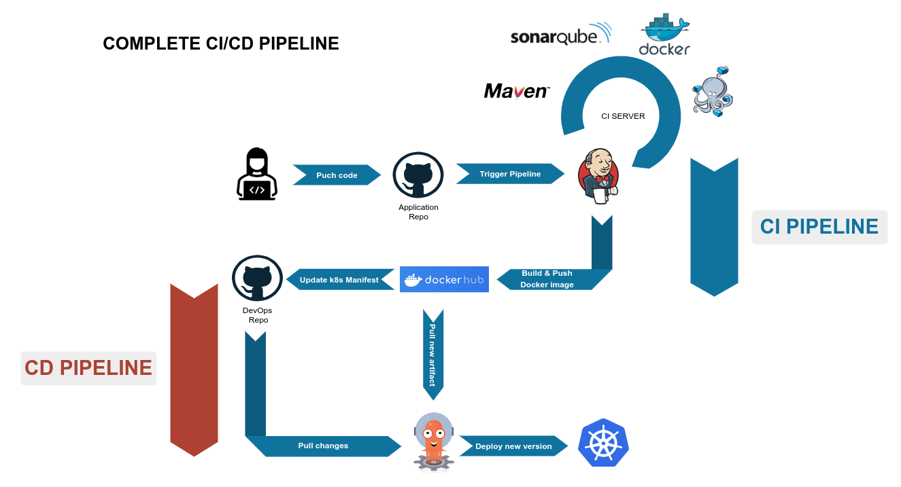

# POC pour le système d'intervention d'urgence en temps réel

Le but de ce projet est de créer un POC (preuve de concept) afin de faire adhérer les parties prenantes au projet de développement d'un système d'intervention d'urgence en temps réel par l'équipe d'architecture métier du consortium MedHead.

Le projet consiste à développer une application en suivant le modèle d'architecture en microservices.

## L'application et ses 5 services

L'application est composée de 5 services qui communiqueront entre eux :

### 4 services backend (Spring Boot REST API) :

- #### speciality-service

  Application Java Web `Spring Boot` qui expose une API REST pour gérer les spécialités.

- #### hospital-service

  Application Java Web `Spring Boot` qui expose une API REST pour gérer les hôpitaux

- #### destination-service

  Application Java Web `Spring Boot` qui expose une API REST pour trouver l'hôpital le plus proche en fonction d'une localisation et une spécialité.

- #### notification-service

  Application Java Web `Spring Boot` qui expose une API REST pour envoyer une notification de réservation à l'hôpital choisit.

### 1 service frontend (React)

- #### medhead-ui

  Application front `React` où les utilisateurs peuvent calculer l'Hôptial le plus proche en fonction de leur position et d'une sélection de spécialité. Toute communication avec `destination-service` se fait en `HTTPS`

## Lancement des applications en localhost

### Méthode 1 : Utiliser des containers (par défaut)

#### Prérequis

- [`Docker`](https://docs.docker.com/get-docker/)
- [`Docker Compose`](https://docs.docker.com/compose/install/)

1. Cloner le projet en local

   ```
    $ git clone https://github.com/samirguemri/OC__P11_CODE.git
    $ cd OC__P11_CODE
   ```

2. Créer et éxecuter des containers

   Ouvrir un `terminal` et, depuis le dossier root qui contient le fichier docker-compose.yaml, executer la commande

   ```
   $ docker compose up -d --build
   ```

   **mongodb**

   - Depuis un terminal, executer les commandes suivantes

   ```
   $ docker cp resources/medhead.hospital.json mongodb:medhead.hospital.json
   $ docker cp resources/medhead.speciality.json mongodb:medhead.speciality.json
   $ docker exec -it mongodb sh
   ```

   - Importer les spécialités et les hôpitaux dans mongodb

   ```
   $ mongoimport --db medhead --collection hospital --authenticationDatabase admin --username rootuser --password rootpass --file medhead.hospital.json --jsonArray
   $ mongoimport --db medhead --collection speciality --authenticationDatabase admin --username rootuser --password rootpass --file medhead.speciality.json --jsonArray
   ```

   **notification-service**

   Depuis un terminal, executer la commande suivante

   ```
   $ docker exec -it kafka bash
   ```

   ensuite, executer la commande suivante depuis le `bash`

   ```
   $ kafka-console-consumer --topic hospitalReservation --bootstrap-server kafka:9092
   ```

### Méthode 2 : Builder et éxecuter en local (quelques adaptations à faire)

#### Prérequis

- [`Java 17+`](https://www.oracle.com/java/technologies/downloads/#java17)
- [`Docker`](https://docs.docker.com/get-docker/)
- [`Maven`](https://maven.apache.org/install.html)
- [`npm`](https://docs.npmjs.com/downloading-and-installing-node-js-and-npm)
- [`MongDB`](https://www.mongodb.com/docs/manual/tutorial/install-mongodb-on-ubuntu/#std-label-install-mdb-community-ubuntu)
- [`kafka`](https://kafka.apache.org/quickstart)

#### Etapes

1. Cloner le projet en local

   ```
   $ git clone https://github.com/samirguemri/OC__P11_CODE.git
   $ cd OC__P11_CODE
   ```

2. Adapter les applications pour éxecuter en local

   - **spaciality-service**

      exécuter les commandes

      ```
      $ mv back/speciality-service/src/main/resources/application.yaml back/speciality-service/src/main/resources/application.yaml.txt
      $ mv back/speciality-service/src/main/resources/application_local.yaml.txt back/speciality-service/src/main/resources/application_local.yaml

   - **hospital-service**

      exécuter les commandes

      ```
      $ mv back/hospital-service/src/main/resources/application.yaml back/hospital-service/src/main/resources/application.yaml.txt
      $ mv back/hospital-service/src/main/resources/application_local.yaml.txt back/hospital-service/src/main/resources/application_local.yaml

   - **notification-service**

      exécuter les commandes

      ```
      $ mv back/notification-service/src/main/resources/application.yaml back/notification-service/src/main/resources/application.yaml.txt
      $ mv back/notification-service/src/main/resources/application_local.yaml.txt back/notification-service/src/main/resources/application_local.yaml

   - **medhead-ui**

      exécuter les commandes

      ```
      $ mv front/medhead-ui/src/setupProxy.js front/medhead-ui/src/setupProxy.js.txt
      $ mv front/medhead-ui/src/setupProxy_local.js.txt front/medhead-ui/src/setupProxy_local.js

     - renommer le ficher **setupProxy.js** en **setupProxy.js.txt**
     - renommer le ficher **setupProxy_local.js.txt** en **setupProxy_local.js**

3. Démarrer MongoDB

   Démarrer le daemon mongod

   ```
   $ sudo systemctl start mongod
   ```

   Importer les spécialités et les hôpitaux dans mongodb

   ```
   $ mongoimport --db medhead --collection hospital --file resources/medhead.hospital.json --jsonArray
   $ mongoimport --db medhead --collection speciality --file resources/medhead.speciality.json --jsonArray
   ```

4. Démarrer kafka

   Depuis le dossier d'installation de kafka :

   - Démarrer le `zookeeper` et le `Kafka broker`

   ```
   $ bin/zookeeper-server-start.sh config/zookeeper.properties
   $ bin/kafka-server-start.sh config/server.properties
   ```

   - Créer le TOPIC `hospitalReservation`

   ```
   $ bin/kafka-topics.sh --create --topic hospitalReservation --bootstrap-server localhost:9092
   ```

   - Se connecter au `kafka-console-consumer` pour visualiser les notification

   ```
   $ bin/kafka-console-consumer.sh --topic hospitalReservation --bootstrap-server localhost:9092
   ```

5. Builder les applications

   **speciality-service**

   1. Ouvrir un nouveau terminal dans le dossier root du projet

   2. Builder speciality-service

   ```
   $ cd back/speciality-service
   $ mvn clean install
   ```

   3. Executer `speciality-service`

   ```
   $ java -jar target/speciality-service-1.0.0-SNAPSHOT.jar
   ```

   **hospital-service**

   1. Ouvrir un nouveau terminal dans le dossier root du projet

   2. Builder hospital-service

   ```
   $ cd back/hospital-service
   $ mvn clean install
   ```

   3. Executer `hospital-service`

   ```
   $ java -jar target/hospital-service-1.0.0-SNAPSHOT.jar
   ```

   **destination-service**

   1. Ouvrir un nouveau terminal dans le dossier root du projet

   2. Builder destination-service

   ```
   $ cd back/destination-service
   $ mvn clean install
   ```

   3. Executer `destination-service`

   ```
   $ java -jar target/destination-service-1.0.0-SNAPSHOT.jar
   ```

   **notification-service**

   1. Ouvrir un nouveau terminal dans le dossier root du projet

   2. Builder notification-service

   ```
   $ cd back/notification-service
   $ mvn clean install
   ```

   3. Executer `notification-service`

   ```
   $ java -jar target/notification-service-1.0.0-SNAPSHOT.jar
   ```

   **medhead-ui**

   1. Ouvrir un nouveau terminal dans le dossier root du projet

   2. Builder medhead-ui

   ```
   $ cd front/medhead-ui
   $ npm install
   ```

   3. Lancer `medhead-ui`

   ```
   $ npm start
   ```

### Tester l'application

- Accéder à l'adresse [`https://localhost:3443`]

- Pour une première connexion, cette page apparaît

  

- Cliquer sur `Paramètres avancés` > `Continuer vers le site localhost (dangereux)`

  vous devez voir ceci

  

- Utiliser `user` et `pass` pour vous connecter

  

- Choisir une localisation et une destination pour calculer l'hôpital le plus proche

  

## tests de performance & tests de charge

### Prérequis

- [`JMeter`](https://jmeter.apache.org/usermanual/get-started.html)

### Tests

- Pour tester la performance de l'application, nous utilisons JMeter

  - Depuis le dossier d'installation de JMeter

  ```
  $ cd bin
  $ sh jmeter.sh
  ```

## Le workflow et la stratégie des branches

Le wokflow choisie est le GitFlow.



### Les branches

- Une branche **_main_** protégée et iso à l'environnement de produciton. Cette branche ne contient qu'un code testé et validé et conserve l'historique des versions officielles.
- Une branche **_develop_** protégée et créée depuis la branche **_main_**. Elle sert de branche d'intégration pour les fonctionnalités.
- Une branche **_feature_** créée pour chaque nouvelle fonctionnalité à partir de la branche **_develop_**.
- Une branche **_release_** créée à partir de la branche **_develop_** pour chaque fin de sprint.
- Une branche **_hotfix_** créée à partir de la branche **_main_** pour gérer et résoudre les bugs survenus dans l'environnement de production.

### Comment ça marche!

- Pour chaque nouvelle fonctionnalité, une nouvelle branche **_feature_** est créée à partir de la branche **_develop_**.
- Lorsque le développement est terminé dans la branche **_feature_**, on fusionne la branche dans **_develop_**.
- Pour chaque nouvelle release (fin de sprint), on créé une nouvelle branche **_release_** à partir de **_develop_**.
- On fusionne la branche **_release_** vers la branche **_main_** et vers la brache **_develop_** si des modifications ont étés apportés.

## Déploiement des applications

Le process complet de la pipeline CI/CD. _Plus de détail dans le repository d'architecture._



### CI Pipeline

Le fichier **_Jenkinsfile_** contient les définitions de notre pipeline Jenkins et utilisé pour automatiser le processus de build, test, et déploiement de notre application. Voici les étapes clés de notre pipeline :

- Build des différents services de l'application
- Exécution des tests
- Validation de la qualité du code
- Build des livrables et enregistrement dans docker hub
- Déclanchement de la pipeline CD

### CD Pipeline (hors scope de la PoC)

Après la mise à jour du répertoire GitHub DevOps, la pipeline DC sera déclanchée et débute le processus de déploiment automatique de la nouvelle version de notre application.

## Arrêt des applications

### docker compose

- Arrêter les `containers`
  ```
  $ docker compose down
  ```

### localhost

- Arrêter l'application

  Pour arrêter les 5 services, aller dans le terminal où ils sont exécutés et taper `Ctrl+C`

- Arrêter mongodb

  ```
  $ sudo systemctl stop mongod
  ```

- Arrêter kafka

  1. Arrêter le **_kafka-console-consumer_** en tapant `Ctrl+C`
  2. Arrêter **_Kafka broker_** en tapant `Ctrl+C`
  3. Arrêter **_ZooKeeper_** en tapant `Ctrl+C`
